# FloppyRider

Full-featured DIY PC-compatible 8-inch Diskette drive based on the IBM 51TD.

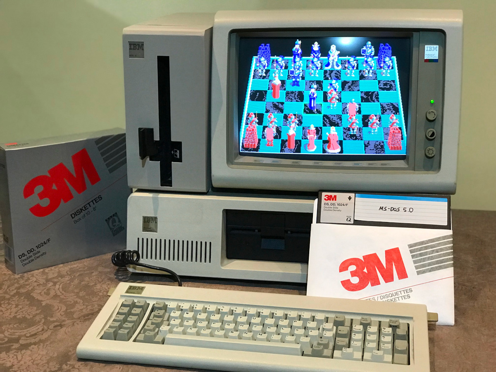

## Project events

__New enclosure and AC power supply (v1.0) (2023/05/02)__

__Third revision of the controller (v2.1) (2022/12/03): Added an improved write protection mechanism and support for installing an external write protection switch.__ __Fabrication files released: [V2 fabrication files](./pcb)__

__Second revision (2022/06/24):__ I have added a transistor to drive the write/erase-gate signals on the IBM drive. I have noticed that write/erase-gate have a very low input impedance (90 ohms each, could that be a safety measure to make harder to accidentally drive the signal high?) that is way over-spec for the 74LS logic to drive properly. The prototype worked by pure luck but trying with other 74LS components the signal level was too low to enable the gates so the device was only capable of reading. The solution is to include a transistor to drive that signals up to acceptable levels.

__Initial release (2022/06/09)__

## Introduction

This project shows how to create an adapter to be able to use IBM 8-inch Diskette drives with a standard PC floppy controller. It includes a controller/adapter, power supply and 3D-printed enclosure designed to connect an IBM 51TD disk drive to a regular PC floppy controller.

In theory it may work also with IBM 31SD drives but I don't have one so it is untested for them.

The current production version is capable of reading, writing and formatting Diskette 1,Diskette 2 (SD) and Diskette 2D (DD) types on a 51TD disk drive.

If you like it or want to make your unit drop me a message to inmbolmie [AT] gmail.com

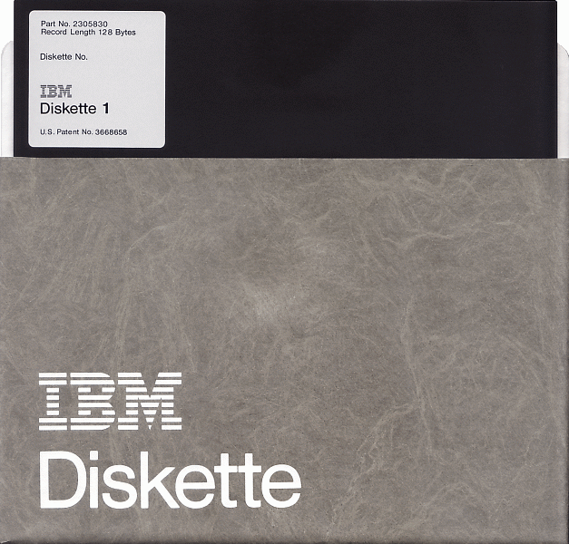

## Videos

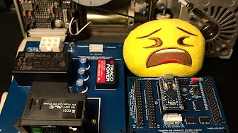

Video showing general operation connected to an IBM 5160: [FloppyRider 8-inch drive for PCs](https://www.youtube.com/watch?v=_m2nTry7Z7E)

Video showing the adapter in action, here it is used to make an 8-inch diskette MSDOS-bootable: [Booting MSDOS from an IBM 51TD 8-inch drive](https://www.youtube.com/watch?v=TbLUqG_d6FU)

Using the adapter to image a 33FD-formatted diskette with Imagedisk: [Imaging on a PC an IBM 8-inch diskette with a 51TD diskette drive, Imagedisk and FloppyRider](https://www.youtube.com/watch?v=4pZ3qMAHVGs)

This project was inspired by CuriousMarc's video about data recovery from 8-inch floppies. This kind of converter is something Master Ken would have made like in five minutes using a Teensy, in case they wanted to use a genuine IBM Diskette drive in their data recovery adventure.

[Fossil Data Part 2: 8-Inch IBM Floppy Data Recovery](https://www.youtube.com/watch?v=5FVwheTVWko)

## Hardware

There are three main components on this project, the drive controller, the power supply and the 3D-printed enclosure

### Drive controller

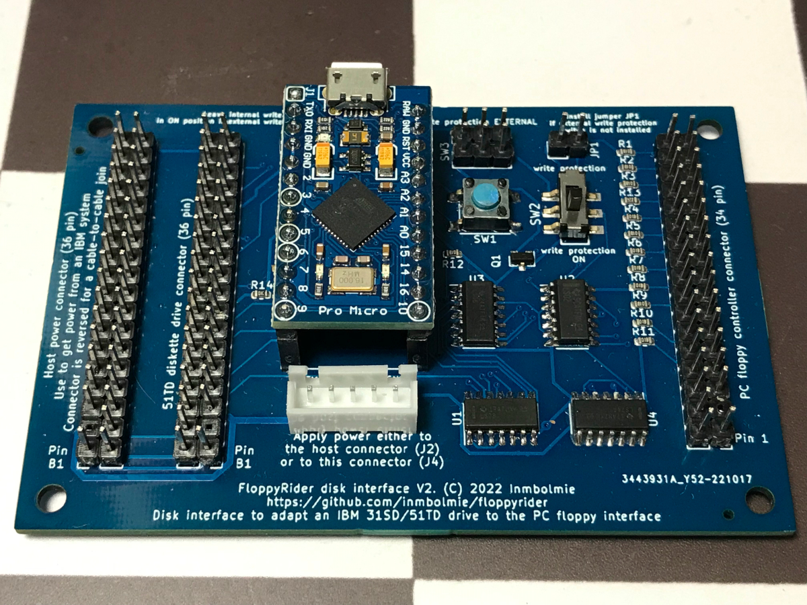

The adapter hardware is pretty straightforward and can be made cheapily with very low-cost components:

* Pin headers and IDC ribbon cables
* JST-XH 5A Connector for DC input
* Arduino ProMicro microcontroller board (5V)
* 74LS02
* 74LS06
* 74LS08
* 74LS74
* 12x1K resistors
* 1x4,7K resistor
* NPN transistor

### Power supply

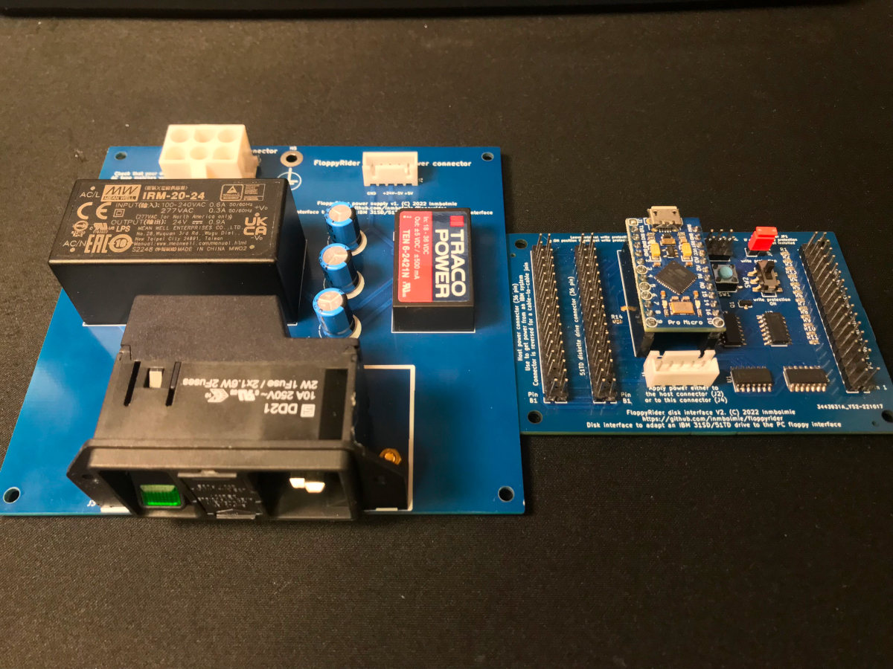

The 31SD and 51TD disk drives have pretty hefty power requirements, as you will need to provide them with:

* AC mains power for the disk rotating motor (on a separate connector)
* +24V at 12W (on the 36-pin idc connector)
* +5V (on the 36-pin idc connector)
* -5V (on the 36-pin idc connector)

I have designed a custom power supply based on discrete AC-DC and DC-DC converters. It is not so cheap to make as the controller as the discrete converters are expensive. The required components are:

* MeanWell IMR-20-24 AC to +24V DC conversion module
* Traco Power TEN 6-2421N DC to +-5V DC conversion module
* JST-XH 5A Connector for DC output
* 3x100uF 50V aluminium electrolytic capacitors
* Schurter DD21.0124.1111 AC plug module
* Schurter 4301.1024.26 fuse holder
* TE Connectivity / AMP 350834-4 connector
* 1A AC fuses

The power supply is fused, cuts both phases on AC input when switched off and connects protective earth to protective earth on the drive connector. The individual modules provide also short-circuit and overload protection.

__Warning, the power supply is compatible with both 110V and 220V drives through the IMR-20-24 module, but does not make any conversion on the AC input that is passed directly to the drive motor. So even with this supply you cannot use a 110V drive on 220V AC line or a 220V drive on 110V AC line. So make sure that your drive is compatible with your AC line voltage__

### 3D-printed enclosure

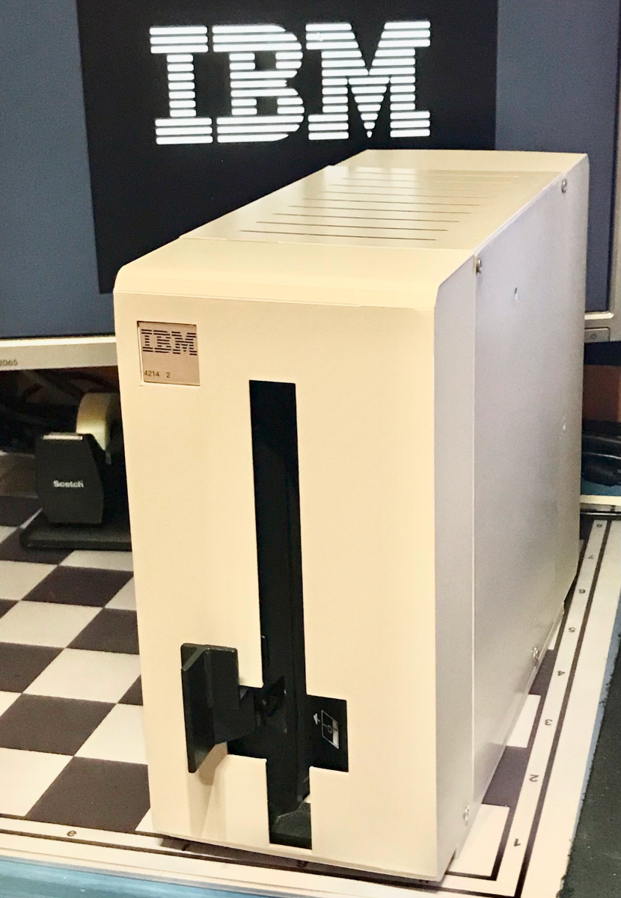

Having a naked 51TD isn't ideal for extended use so I have designed a 3D-printed case that can be made using regular printers and is inspired on the IBM drive enclosures of the era.

Note that this is a BIG print job, has many parts and can take like a full week of non-stop printing to make. It is also tricky to assemble, as some parts have to be glued-in to keep the part design and printing as simple as possible. The total printing material required is around 850-1000 grams depending on the infill used on some parts.

You also need at least a 270 x 210mm sized 3d-printer bed to be able to print this. The biggest pieces measured by printed area are the side panels.

I include STL files for all the parts as well as the Freecad 3D model.

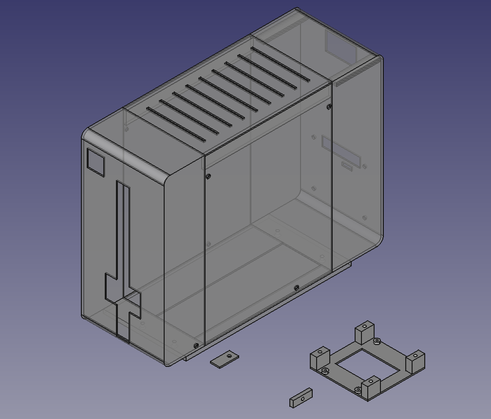

You can get the STL and design files in the __case__ directory.

## Software

You can get the Arduino source code for the ProMicro in the __FloppyRider__ directory. You can program it using the regular Arduino IDE.

## KiCad Project

You can get the current project files in the __KiCad__ directory. The PCB design files and gerbers are now available if you want to make your own boards :  [V2 fabrication files](./pcb)

Note that the files have been created with Kicad v6.

## Warning about some floppy controllers

It seems that some floppy controllers may ground the signals to the floppy drive when the computer is switched off. If you have a diskettte inserted and engaged when this happens, that can lead to the track where the head is currently positioned to be erased.

If you are working with important media be careful about this, and __turn on the disk drive only after the computer is switched on, and remove the diskette or the power to the disk drive before the computer is switched off.__

__The version 2 board improves this situation__ because when the write protection switch is engaged, the Write/Erase Gate signals for the 8" drive are physically disconnected from the incoming write signals, so you won't accidentally erase any data __if write protection is engaged__, even if the host floppy controller grounds all the interface signals. This makes the adapter safer for using in disk imaging tasks.

## Operation

These are the main points that need to be carried out for conversion:

#### Logic levels

The PC floppy signals are open collector low-level active, while the IBM signals are push-pull high-active. The 74 series chips provide most of the conversion.

All the signals are gated by the "drive select" PC signal for the adapter to be able to operate with another floppy drive on the same cable.

#### Track addressing

The PC floppy adresses tracks by a "direction" and "step" signal, and gets a "track 0" signal when the head is placed at such track. The IBM interface lacks a "track 0" signal and you control direcly the stepper motor signals "access 0" and "access 1". The ProMicro initializes the head position at track 0 at startup. From there it gets track of where the head is actually positioned and translates the required signals on both sides.

#### Write data signal.

The PC floppy write data signal generates a full pulse (falling and rising edge) for each magnetic flux transition that needs to be recorded on the disk surface, while in the IBM interface the "write data" signal records a magnetic flux transition for each signal level change (rising or falling edge). The conversion is made via the 74LS74 flip-flop.

## Connection

__As the connectors carry a powerful +24V signal, connector orientation is critical and getting it wrong, reversing or misplacing it could damage your hardware.__

### Option A: Power the drive from a compatible host system

The easier way to get all the required power rails is getting them from the original host hardware where the disk drive is enclosed. For that reason a 36-pin host connector header is provided. Note that the connector sides are mirrored to be able to use it with a cable-to-cable connection. The adapter will be placed as a bridge between the host cable and the disk drive header.

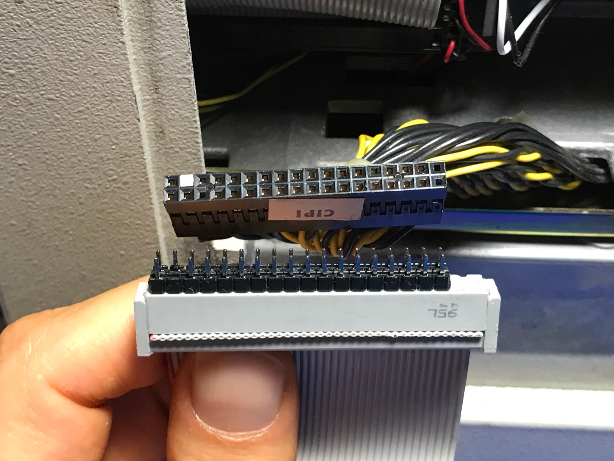

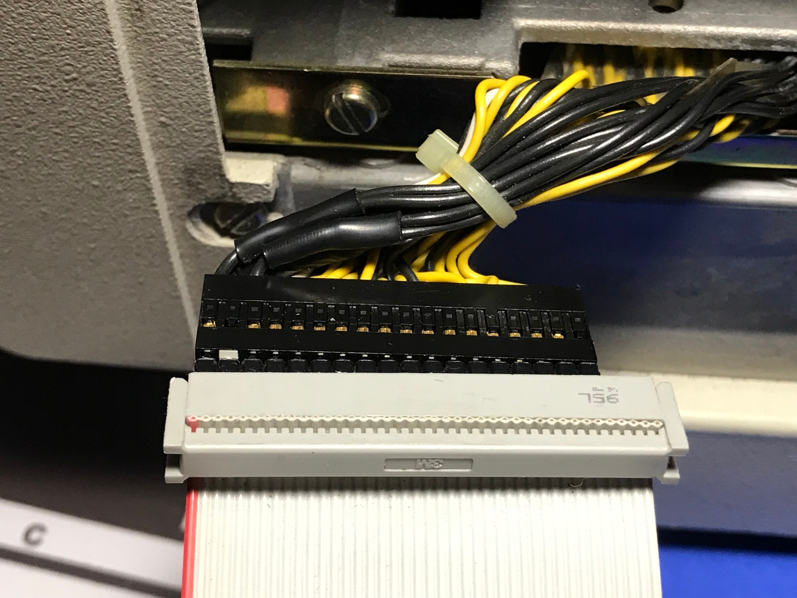

The other 36-pin header will be used with a regular IDC ribbon cable connector to connect it to the disk drive. Note that you won't be _easily_ able to use the most common 40-pin cables as the available space for the connector in the disk drive is very limited.

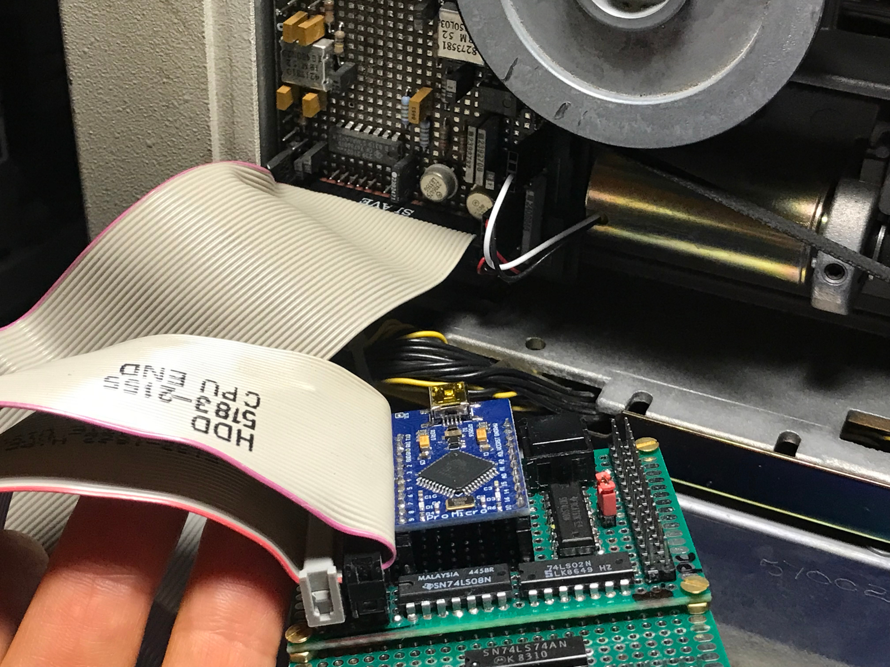

Not that "Pin B1" position is indicated on the silkscreen of the PCB.

### Option B: Power the drive from the independent power supply

If you have the FloppyDriver independent power supply capable of providing the required DC levels you can leave the 36-pin host pin header unconnected and provide power via a separate 5-pin JST-XH connector.

### Connection to the PC drive controller

On the other end of the adapter you have a 34-pin header for the PC standard floppy cable. The adapter is hard-wired for drive B as most PC floppy drives are.

Not that "Pin 1" position is indicated on the silkscreen of the PCB.

## External write protection

A 6-pin 2x3 pin header is provided to be able to connect an external SPDT write protection switch. In case of __using the external write protection switch, the on-board switch has to be placed in the ON position and jumper JP1 has to be removed__. Then you can control the ON-OFF write protection status from the external switch.

On the contrary, __if you are using the on-board write protection switch, the JP1 jumper has to be installed__. The jumper is not safety-critical though, as the effect of not installing it will be that the host controller will consider the write protection always disabled, but the drive will be write-protected anyway if the write protection switch is in the ON position.

## Schematics

As currently working on the production units. Subject to further modification

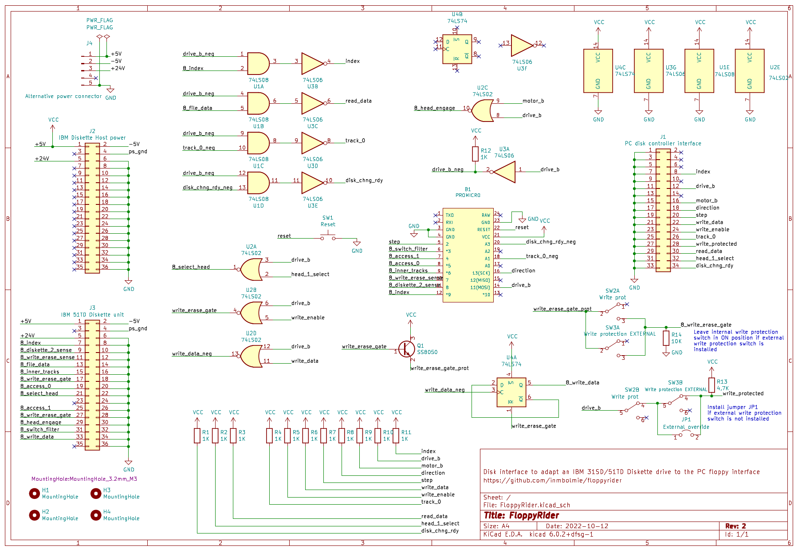

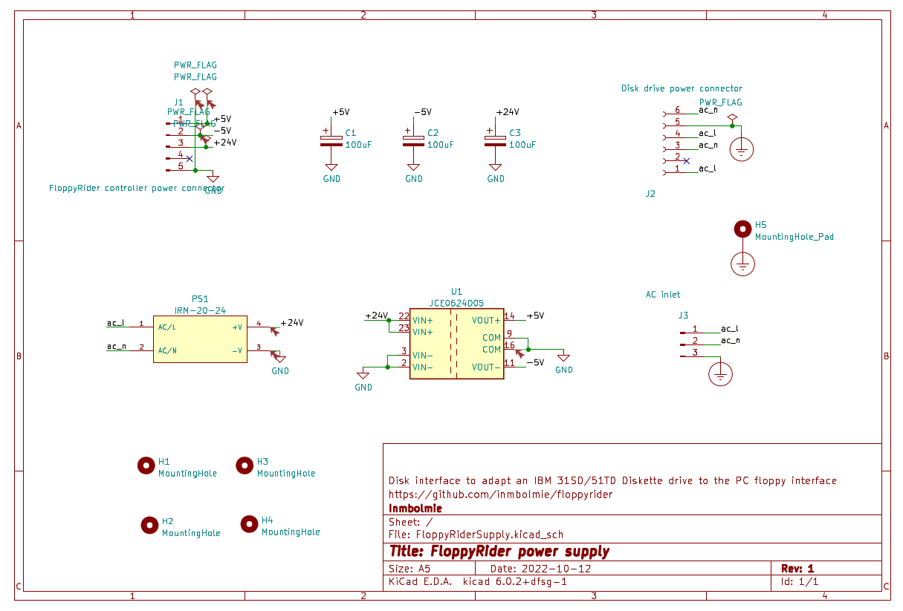

## PCB

Sample image of the PCBs from Kicad.

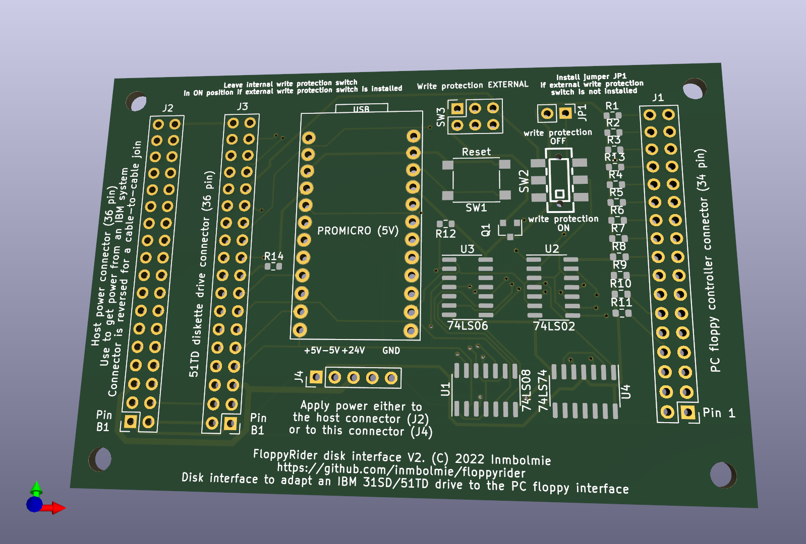

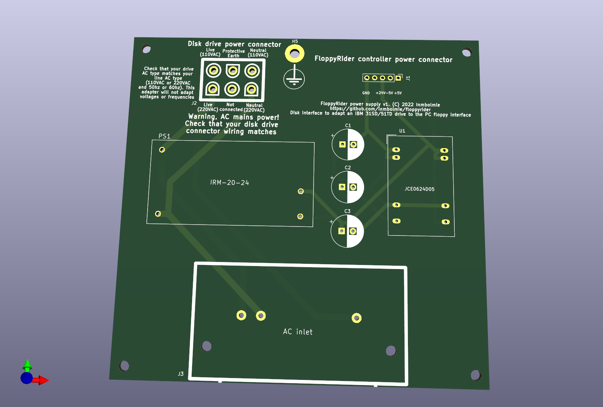

## 3D-printed case fabrication and assembly

This enclosure has been designed to be reasonably easy to print on a 3D printer with a 270 x 210mm sized bed, on regular PLA filament and in a maximum of 14 hours of printing for a single piece.

With 2mm thick walls the case is sturdy enough to be convenient to carry around the assembled unit, but obviously doesn't have the rigidity of a full-metal or ABS injection-molded enclosure.

It is designed to be assembled using 10mm M4 DIN-965 bolts and nuts. A couple of M3 bolts and nuts are also required for the power supply, and four 5mm M2,5 bolts for the controller PCB attachment. The nuts have to be soldered to the enclosure with the superglue-soda method on some places and some pieces have to be glued together. That minimal assembly allows to simplify the piece design and all the pieces can be printed without supports. In reality it would be better to print 3mm thick walls to get a better mount for the M4 bolts (they will protrude a little on 2mm walls) but that would increase notably the printing times.

Of course you can also reduce the times increasing the layer height. I printed eveything at 0,2mm layer height but 0,3 or 0,4mm could be more convenient.

All the pieces have been printed on regular PLA, no supports, 0,2mm layer heigh, infill 100% except for the base that was printed with 20% infill. The printing time for the big pieces on my printer is between 7 and 14 hours (14 for back panel). In total it took me around a week to print everything, one big piece each day. In total I used approx. 850 grams of 1,75mm filament.

Now I will give some assembly tips.

There are two versions of the front panel, one with a window for a 25x25mm badge and one without it.

To assemble the unit first you have to join the front panel to the base with two bolts and two nuts. You will have to drill the holes on the front panel baseas they are not included. These like other holes are not included because I think that drilling them yourself will give a better piece alignment. Drill them with a 4mm drill.

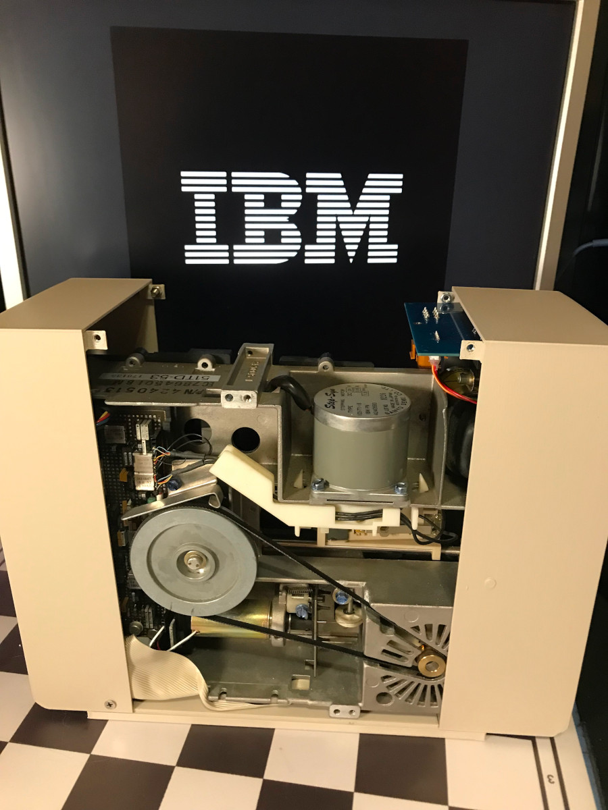

For the back panel the attachment is similar but you will have to be able to remove it without access to the nuts so the nuts will have to be fixed with the superglue+soda method or any other similar system. That way you will be able to tighten the bolts from under the base when the drive is in place

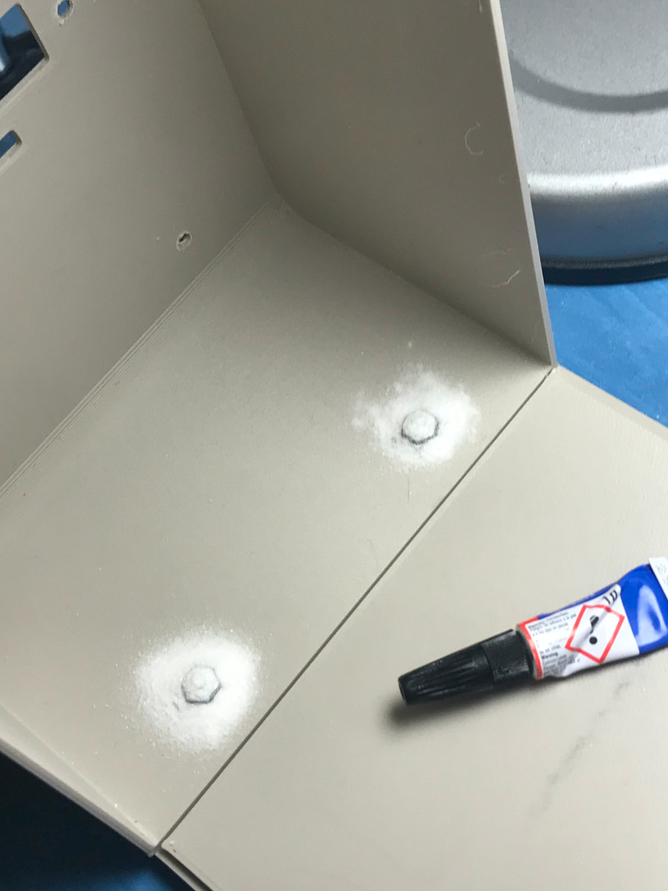

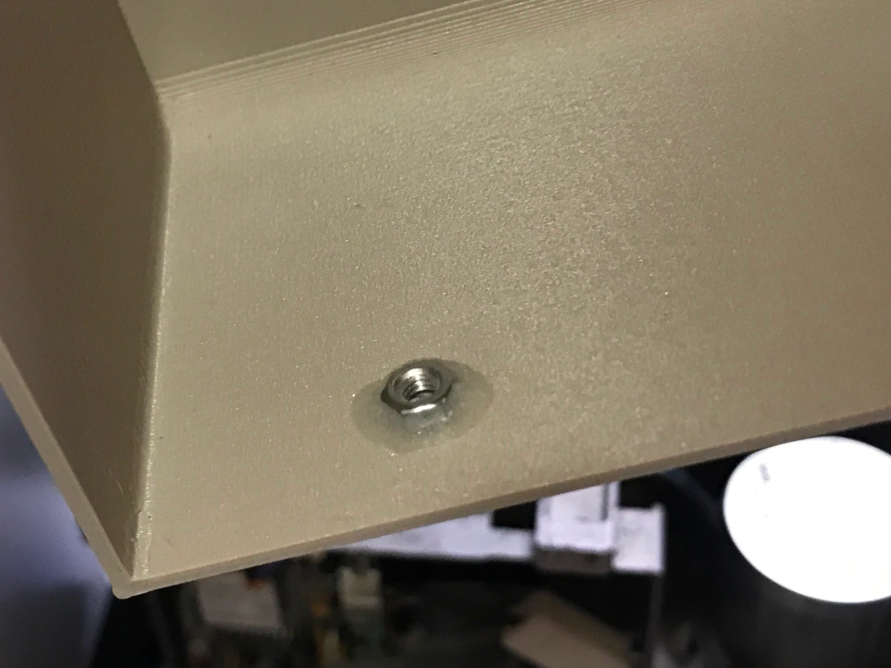

Now place the drive inside and align it to the holes on the right side (looking from the front) panel and the right side of the front panel. Be gentle with the front lever of the unit as it is quite fragile, it has to be engaged to go inside the slit.

The left panel will be far from the drive, so you will have to print three drive fitting blocks and solder them to the base using superglue like shown here (there is another place not shown on the picture to place a fitting to the right). The inner fitting is for the drive and the outer fitting is for the panel. You can in theory use very long M4 bolt to stick the panel to the drive, but it is better to use two 10mm short bolts instead. The holes on the fittings have to be aligned to the holes on the drive and panel.

You have to assemble also four panel fittings on top of the front and back pieces to secure the side panels. They are shown on the first picture near the top. They have a nut each on back. Be sure to align them to the holes on the side panels. On the final design the fittings are a little lower than on the picture because I discovered that they interferred with the power supply pcb position and because of that they were tricky to fix to the back panel.

To align the fittings it would be more convenient to separate the front and back panels from the base. Now prepare the top, left and right panels that have to be glued together. Then put everything upside down together and attach and glue the fittings to the front and back panels.

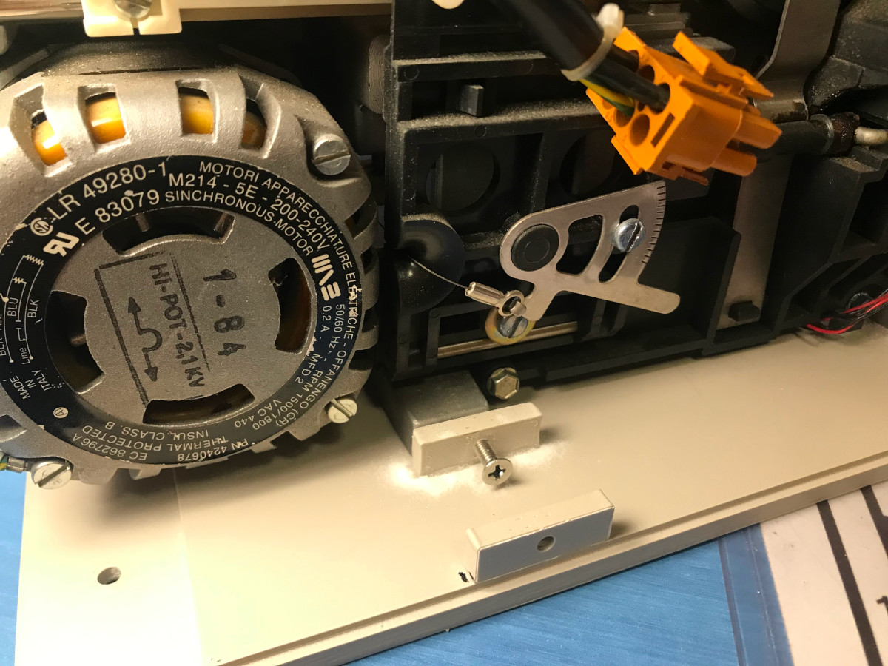

Now prepare the cable, you need approx. a 60cm 36-pin IDC ribbon cable. Note that the drive pin header is a tight fit for the cable, so you cannot use anything else bigger, like the more common 40-pin ribbon cable connectors.

The cable goes under the drive. There is a channel made on the base to allow the cable to go under the drive mounting feet.

Check carefully for Pin-1 position. On the picture the red cable indicates pin-1 and goes to the left of the connector as seen looking the drive from the right side.

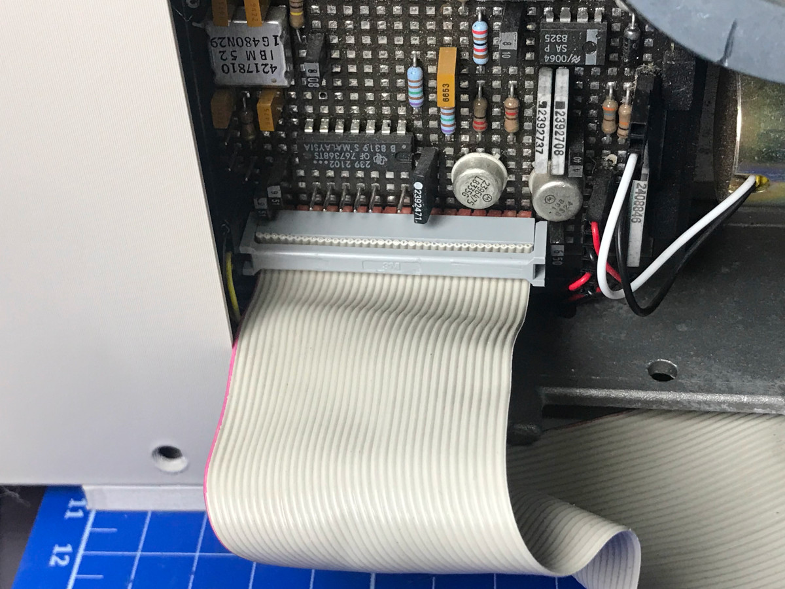

Now prepare the back panel, mounting the power supply with M3 bolts and nuts. The controller is mounted on top of the PCB-holder piece using M2,5 bolts. Connect the supply and the controller using a suitable 5-pin JST-XH cable. Connect the drive 36-pin ribbon cable before the controller is assembled. Check carefully for pin-1 position, on the PCB is marked as "Pin B1". Note that the red cable goes to that side.

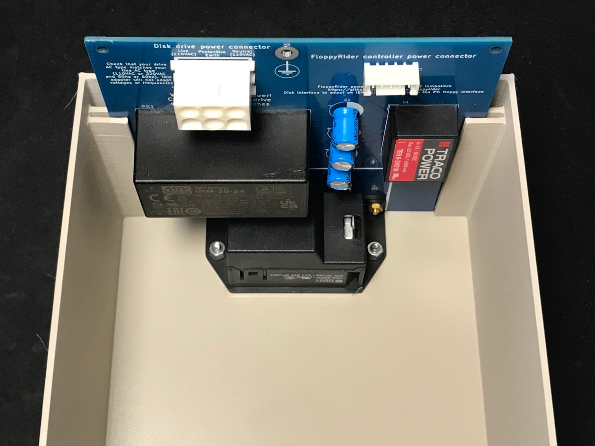

Do not forget to put in place the write protection switch between the controller and the back panel. You will need to drill a 2mm hole in the center of the switch to slide it onto the switch lever mounted on the PCB. To insert it you have to bend the back "ears" and straighten them again after inserted. The on-board swith is very simple, you may want to change it for a proper external SPDT switch as the controller PCB supports it.  

Switch to the right is write protected, switch to the left is write enabled. I didn't include any lettering to keep the printing simple, but you can add it or put on a sticker to indicate it.

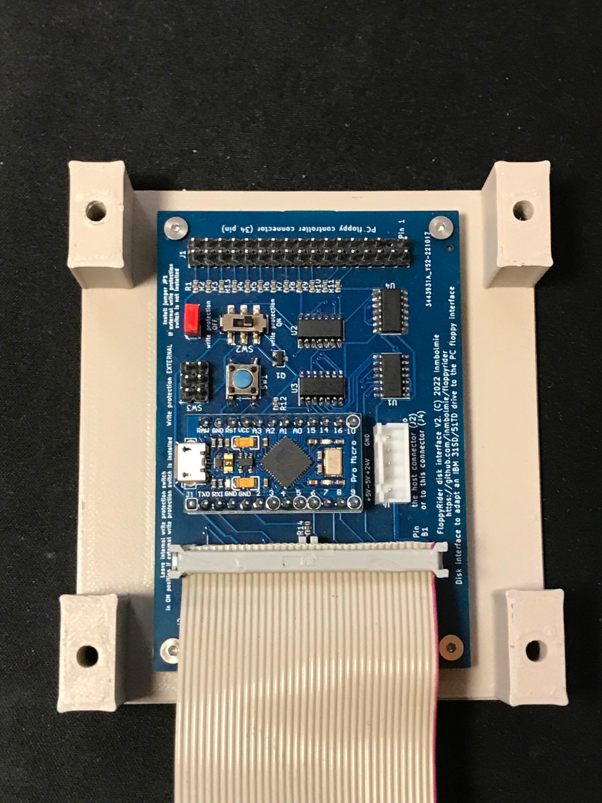
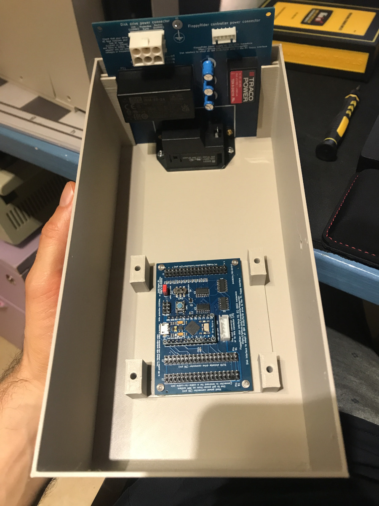

Now you can put in place the back panel and tighten the bolts from under the base to hold it in position.

When the panel is in, place attach the 51TD power connector to the power supply. This connector can only go one way.

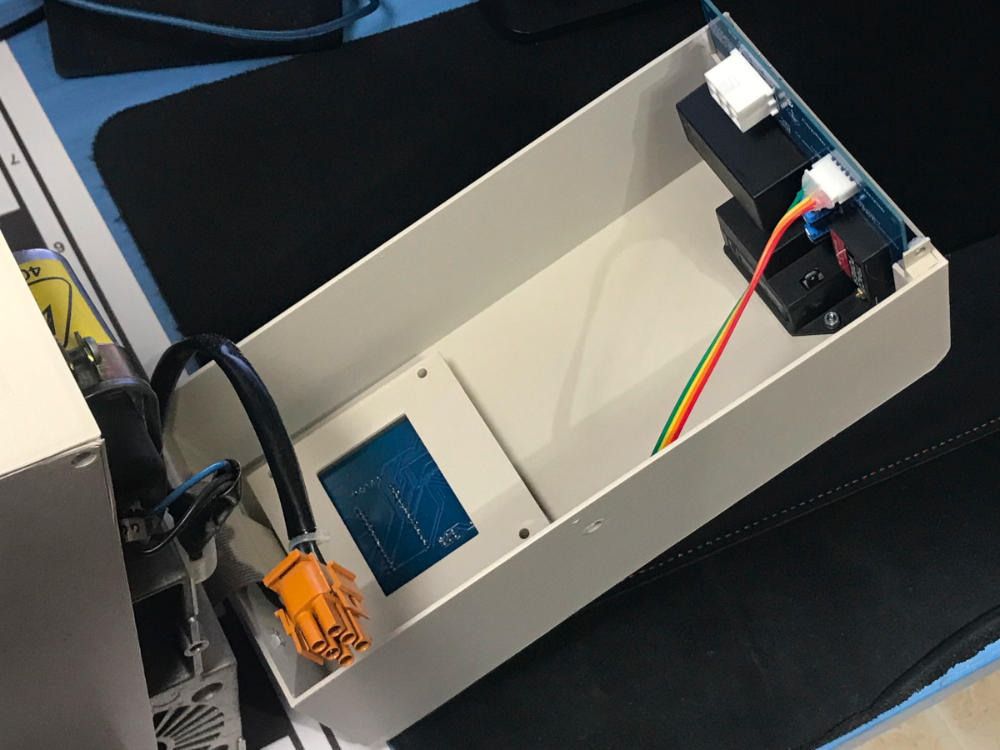
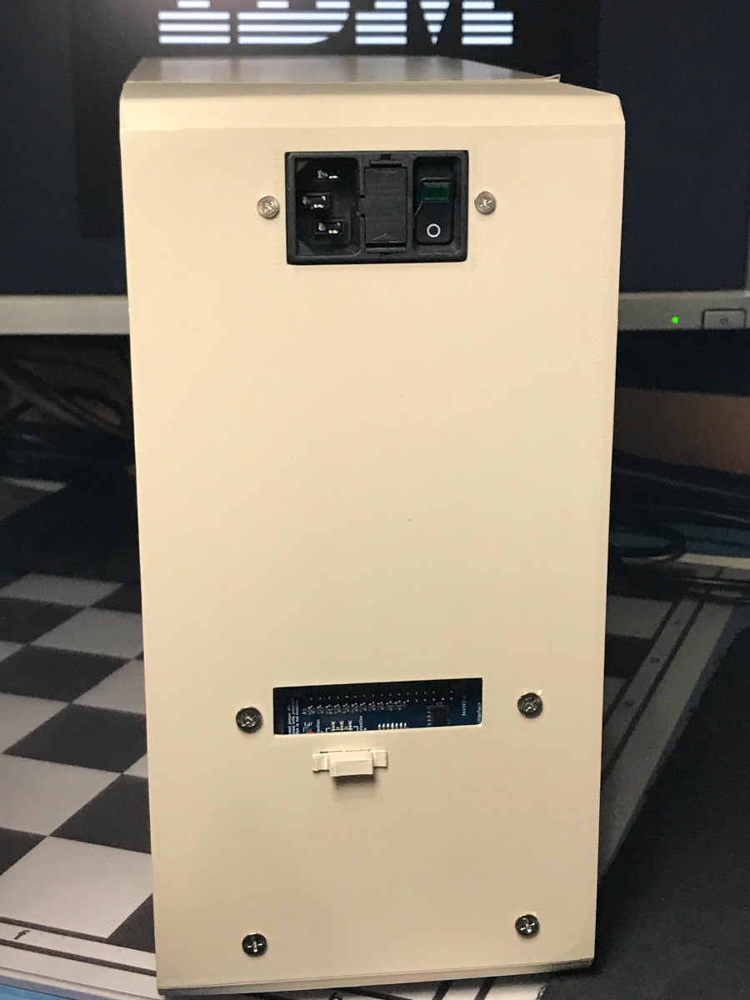

Now finally mount the center section. The top, left and right panels were already glued together. Attach them using M4 bolts to the drive on the left, to the fitting glued to the base on the right, and to the front and back panels on the top using four bolts. Do not overtighten anything as you risk to rip the nuts from the pieces and in general is not needed.

This a sample of how could the unit look on the back connected to a PC. If you are going to have a setup like this add some anti-slip rubber feet under the drive base.

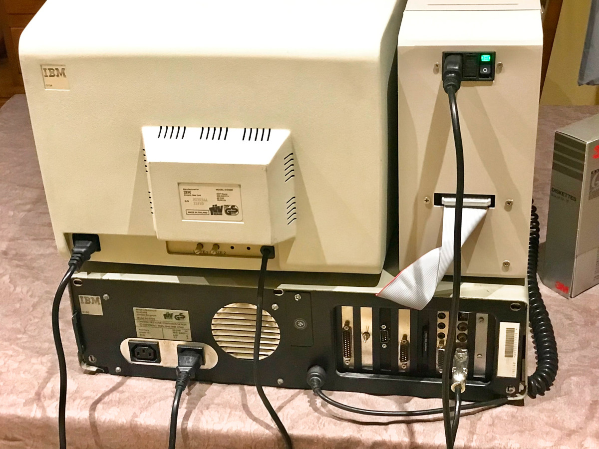
